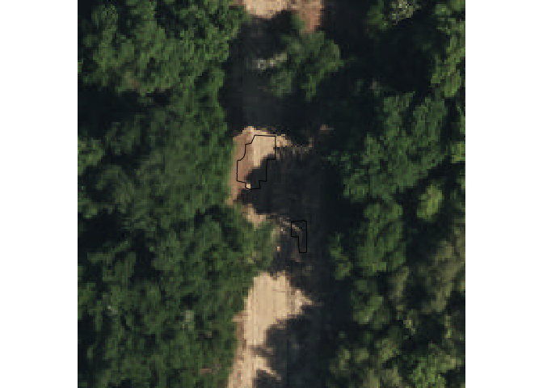
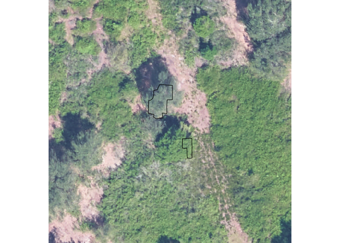
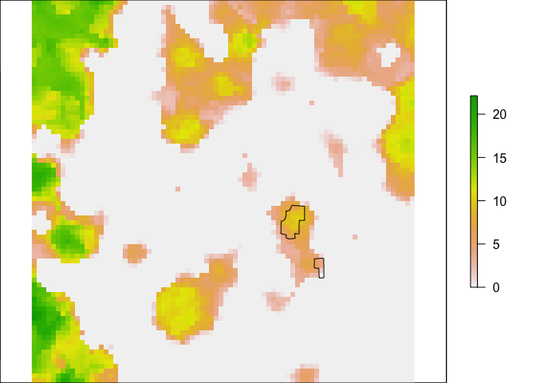
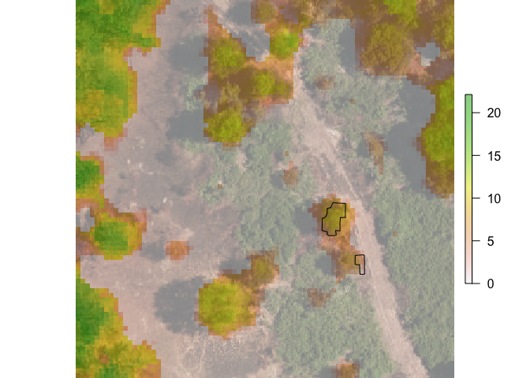

```r
library(raster)
```

```
## Loading required package: sp
```

```r
library(maptools)
```

```
## Checking rgeos availability: TRUE
```

```r
library(rgdal)
```

```
## rgdal: version: 1.3-3, (SVN revision 759)
##  Geospatial Data Abstraction Library extensions to R successfully loaded
##  Loaded GDAL runtime: GDAL 2.1.3, released 2017/20/01
##  Path to GDAL shared files: /Library/Frameworks/R.framework/Versions/3.5/Resources/library/rgdal/gdal
##  GDAL binary built with GEOS: FALSE 
##  Loaded PROJ.4 runtime: Rel. 4.9.3, 15 August 2016, [PJ_VERSION: 493]
##  Path to PROJ.4 shared files: /Library/Frameworks/R.framework/Versions/3.5/Resources/library/rgdal/proj
##  Linking to sp version: 1.3-1
```

```r
itc<-readOGR("../data/ITCs/test/ITC_OSBS_018.shp")
```

```
## OGR data source with driver: ESRI Shapefile 
## Source: "/Users/ben/Documents/TreeSegmentation/data/ITCs/test/ITC_OSBS_018.shp", layer: "ITC_OSBS_018"
## with 2 features
## It has 3 fields
```

```r
crs(itc)<-CRS('+init=EPSG:32617')
  
y2017<-stack("../data/2017/Camera/OSBS_018.tif")
y2015<-stack("../data/2015/Camera/OSBS_018.tif")
crs(y2015)<-CRS('+init=EPSG:32617')
crs(y2017)<-CRS('+init=EPSG:32617')

plotRGB(y2015)
plot(itc,add=T)
```

<!-- -->

```r
plotRGB(y2017)
plot(itc,add=T)
```

<!-- -->

```r
competition<-stack("/Users/ben/Dropbox/Weecology/ECODSEdataset/RSdata/camera/OSBS_018_camera.tif")
plotRGB(competition)
plot(itc,add=T)
```

<!-- -->

```r
crs(competition)<-CRS('+init=EPSG:32617')

chm<-raster("/Users/ben/Dropbox/Weecology/ECODSEdataset/RSdata/chm/OSBS_018_chm.tif")
plot(chm)
plot(itc,add=T)
```

<!-- -->

```r
plotRGB(competition)
plot(chm,add=T,alpha=0.5)
plot(itc,add=T)
```

<!-- -->
